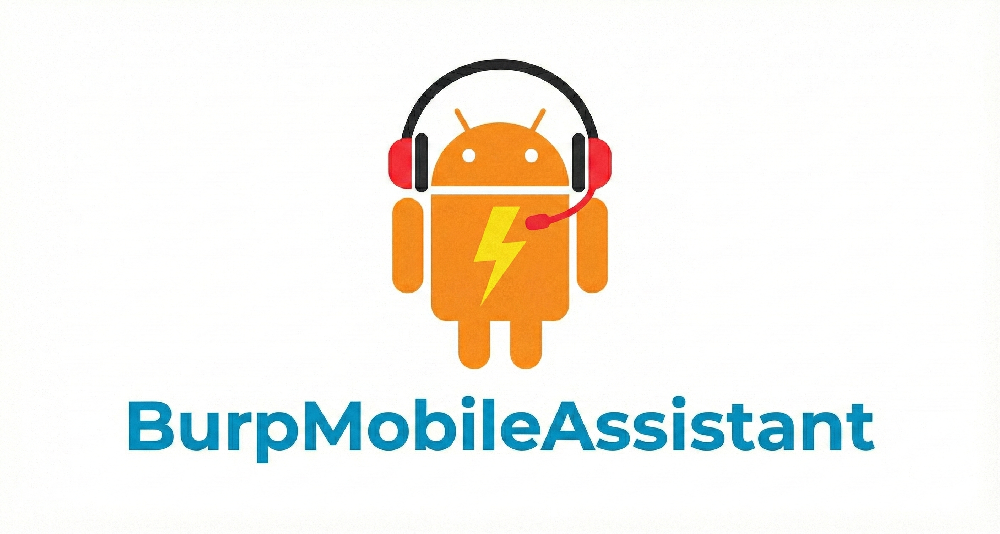
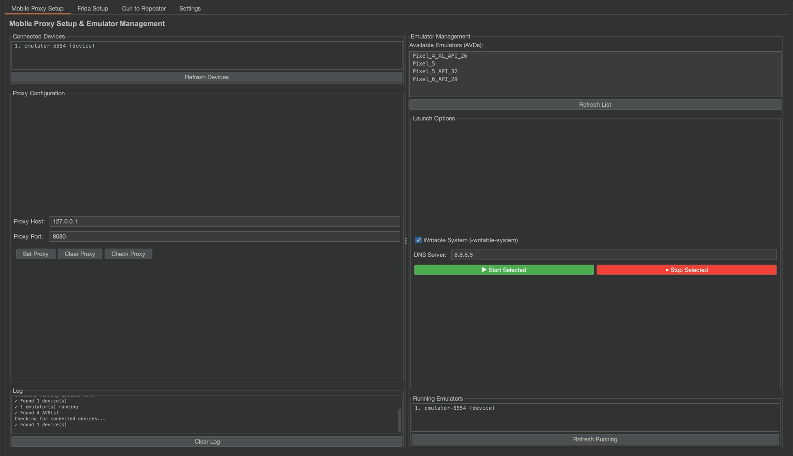
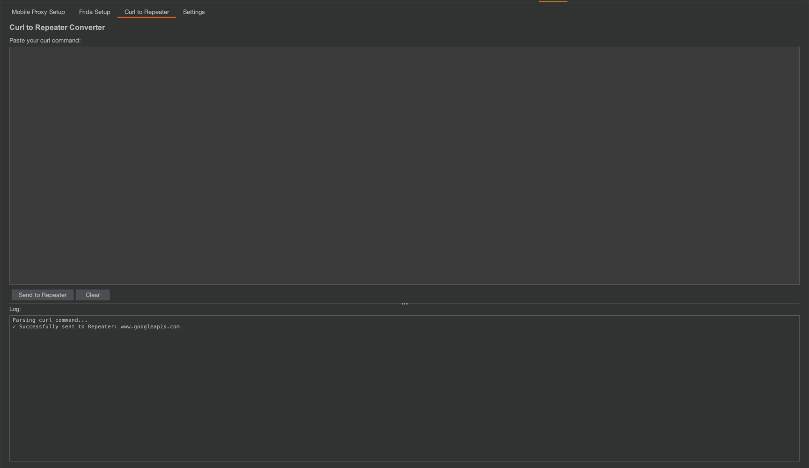

# BMA - Burp Mobile Assistant



A comprehensive Burp Suite extension that streamlines mobile application security testing by providing essential automation tools for proxy configuration, Frida server deployment, and request manipulation.

## Table of Contents

- [Overview](#overview)
- [Features](#features)
- [Prerequisites](#prerequisites)
- [Installation](#installation)
- [Quick Start](#quick-start)
- [Usage Guide](#usage-guide)
- [Building from Source](#building-from-source)
- [Configuration](#configuration)
- [Troubleshooting](#troubleshooting)
- [Project Structure](#project-structure)
- [Contributing](#contributing)
- [License](#license)

## Overview

BMA (Burp Mobile Assistant) is designed to simplify and automate common tasks in mobile application security testing. It integrates seamlessly with Burp Suite and provides an intuitive interface for managing Android device connections, setting up Frida instrumentation, and converting curl commands to Burp Repeater requests.

## Features

### 1. Mobile Proxy Setup
- Automatic detection of connected Android devices via ADB (Note: <b>I suggest starting the emulator without this extension, as I have noticed some memory issues.</b>)
- Easy proxy configuration on Android devices
- Customizable proxy host and port settings
- Proxy status checking and verification
- Clear proxy settings with one click
- Automatic ADB reverse port forwarding
- Support for multiple devices simultaneously
  

### 2. Frida Server Management
- Automatic device architecture detection (arm64, arm, x86, x86_64)
- Download latest Frida server releases from GitHub
- Automated deployment to Android devices
- Start/Stop Frida server with proper process management
- Status monitoring and verification
- Version tracking and management
- One-click full auto setup
- Proper handling of zombie/defunct processes
- 

### 3. Curl to Repeater Converter (inspired by: https://github.com/Gauravjha68535/Curl-To-Repeater)
- Convert any curl command to a Burp Repeater request
- Supports all common curl flags and options
- Automatic parsing of headers, cookies, and request bodies
- Handles GET, POST, PUT, DELETE, and other HTTP methods
- One-click send to Repeater


### 4. Settings & Configuration
- Automatic ADB path detection
- Manual ADB path configuration
- ADB connection testing and verification
- Persistent settings across sessions
- Platform-specific path suggestions (macOS, Linux, Windows)

## Prerequisites

### Required Software

1. **Java Development Kit (JDK) 21 or higher**
   ```bash
   java -version
   ```

2. **Burp Suite Professional or Community Edition**
   - Version with Montoya API support

3. **Android Debug Bridge (ADB)**
   ```bash
   adb version
   ```

### Installing ADB

**macOS (via Homebrew):**
```bash
brew install android-platform-tools
```

**Linux (Ubuntu/Debian):**
```bash
sudo apt-get install android-tools-adb
```

**Windows:**
- Download from [Android Developer website](https://developer.android.com/studio/releases/platform-tools)
- Add to system PATH

### Android Device Setup

1. Enable Developer Options on your Android device
2. Enable USB Debugging
3. Connect device via USB
4. Accept USB debugging prompt on device

## Installation

### Option 1: Download Pre-built JAR

1. Download `BurpMobileAutomation.jar` from the releases section
2. Open Burp Suite
3. Navigate to **Extensions > Installed**
4. Click **Add**
5. Select **Extension Type: Java**
6. Click **Select file** and choose the downloaded JAR
7. Click **Next**

The extension will load and the "BMA" tab will appear in Burp Suite.

### Option 2: Build from Source

See [Building from Source](#building-from-source) section below.

## Quick Start

### First-Time Setup

1. **Load the Extension**
   - Load BMA extension in Burp Suite
   - Navigate to the **BMA** tab

2. **Configure ADB (if needed)**
   - Go to **Settings** tab
   - Click **Auto-Detect** to find ADB automatically
   - Or click **Browse** to select ADB manually
   - Click **Test ADB Connection** to verify
   - Click **Save ADB Path**

3. **Connect Your Device**
   - Connect Android device via USB
   - Ensure USB debugging is enabled
   - Run `adb devices` in terminal to verify connection

### Basic Workflow

1. **Set Up Proxy on Device**
   - Go to **Mobile Proxy Setup** tab
   - Click **Refresh Devices**
   - Enter your computer's IP address (e.g., 192.168.1.10)
   - Enter Burp's proxy port (default: 8080)
   - Click **Set Proxy**

2. **Install CA Certificate** (manual step)
   - Export Burp's CA certificate
   - Install on Android device

3. **Start Testing**
   - Traffic from device will now flow through Burp Suite

## Usage Guide

### Curl to Repeater

**Purpose:** Quickly convert curl commands from browser DevTools or API documentation into Burp Repeater requests.

**Steps:**
1. Navigate to **Curl to Repeater** tab
2. Paste curl command into text area
3. Click **Send to Repeater**
4. Request appears in Burp Repeater

**Example:**
```bash
curl 'https://api.example.com/users' \
  -H 'Authorization: Bearer token123' \
  -H 'Content-Type: application/json' \
  -d '{"username":"test"}'
```

### Mobile Proxy Setup

**Configure Proxy:**
1. Click **Refresh Devices** to see connected devices
2. Enter proxy host (your computer's IP address)
3. Enter proxy port (Burp's proxy port, usually 8080)
4. Click **Set Proxy**

**Check Proxy Status:**
1. Click **Check Proxy**
2. View current proxy configuration in log output

**Clear Proxy:**
1. Click **Clear Proxy**
2. Device will use direct connection

**Note:** ADB reverse port forwarding is automatically configured when setting proxy.

### Frida Server Setup

**Full Auto Setup (Recommended):**
1. Navigate to **Frida Setup** tab
2. Click **Full Auto Setup**
3. Wait for automatic detection, download, push, and start
4. Monitor progress in log output

**Manual Step-by-Step:**
1. Click **Auto-Detect Architecture** (or select manually)
2. Click **Download Frida Server**
3. Click **Push to Device**
4. Click **Start Frida Server**

**Stop Frida Server:**
1. Click **Stop Frida Server**
2. Process will be properly terminated

**Check Status:**
1. Click **Check Status**
2. View running Frida processes

### Settings & Configuration

**Auto-Detect ADB:**
1. Go to **Settings** tab
2. Click **Auto-Detect**
3. System will search common ADB locations

**Manual ADB Configuration:**
1. Click **Browse**
2. Navigate to ADB location
3. Select `adb` executable
4. Click **Save ADB Path**

**Test ADB:**
1. Click **Test ADB Connection**
2. View status (Green = Working, Orange = Warning, Red = Error)
3. See connected device count

## Building from Source

### Prerequisites for Building

- JDK 21 or higher
- Gradle (included via Gradle Wrapper)

### Build Steps

**UNIX-based systems (macOS, Linux):**
```bash
cd /path/to/BMA
./gradlew clean build
```

**Windows:**
```cmd
cd \path\to\BMA
gradlew.bat clean build
```

### Build Output

The compiled JAR file will be located at:
```
build/libs/BurpMobileAutomation.jar
```

### Setting Java Home (if needed)

**macOS/Linux:**
```bash
export JAVA_HOME=/path/to/jdk-21
./gradlew clean build
```

**Windows:**
```cmd
set JAVA_HOME=C:\path\to\jdk-21
gradlew.bat clean build
```

## Configuration

### ADB Path Configuration

The extension automatically searches for ADB in common locations:

**macOS:**
- `/usr/local/bin/adb`
- `~/Library/Android/sdk/platform-tools/adb`
- System PATH

**Linux:**
- `/usr/bin/adb`
- `~/Android/Sdk/platform-tools/adb`
- System PATH

**Windows:**
- `%USERPROFILE%\AppData\Local\Android\Sdk\platform-tools\adb.exe`
- System PATH

### Persistent Settings

Settings are stored in memory during the session and can be saved for future use via the Settings tab.

## Troubleshooting

### ADB Not Found

**Problem:** Extension cannot find ADB automatically

**Solution:**
1. Go to **Settings** tab
2. Click **Browse** button
3. Navigate to your Android SDK location
4. Select the `adb` executable (or `adb.exe` on Windows)
5. Click **Save ADB Path**
6. Click **Test ADB Connection**

### No Devices Detected

**Problem:** No devices appear after clicking "Refresh Devices"

**Solution:**
1. Verify device is connected via USB
2. Ensure USB debugging is enabled
3. Accept USB debugging prompt on device
4. Run `adb devices` in terminal to verify
5. Try `adb kill-server` then `adb start-server`

### Frida Server Won't Stop

**Problem:** Frida server remains running or becomes zombie process

**Solution:**
- Extension now uses PID-based termination
- Automatically handles zombie/defunct processes
- Uses `kill -9` for forceful termination
- Try clicking **Stop Frida Server** again
- If persistent, manually kill via `adb shell`

### Proxy Not Working

**Problem:** Device traffic not appearing in Burp

**Solution:**
1. Verify proxy is set: Click **Check Proxy**
2. Ensure device and computer are on same network
3. Check firewall settings
4. Verify Burp is listening on correct interface
5. Ensure CA certificate is installed on device
6. Check that app doesn't use certificate pinning

### Port Forwarding Issues

**Problem:** Cannot connect to localhost services

**Solution:**
- Port forwarding is automatic when setting proxy
- Manually run: `adb reverse tcp:8080 tcp:8080`
- Check for conflicting port forwards: `adb reverse --list`

## Project Structure

```
src/main/java/
├── Extension.java              # Main extension entry point
├── ui/
│   ├── MainUI.java            # Main tabbed interface
│   ├── CurlToRepeaterPanel.java
│   ├── MobileProxyPanel.java
│   ├── FridaSetupPanel.java
│   └── SettingsPanel.java
└── utils/
    ├── ADBHelper.java         # ADB command wrapper
    ├── CurlParser.java        # Curl command parser
    ├── EmulatorHelper.java    # Android emulator utilities
    └── FridaHelper.java       # Frida server management

docs/                          # Documentation files
build.gradle.kts              # Gradle build configuration
settings.gradle.kts           # Gradle settings
```

## Contributing

Contributions are welcome! Please follow these guidelines:

1. Fork the repository
2. Create a feature branch
3. Make your changes
4. Test thoroughly
5. Submit a pull request

## License

This project is licensed under the terms specified by PortSwigger.

## Acknowledgments

- Built using Burp Suite Montoya API
- Frida server binaries from [Frida Project](https://frida.re/)
- Template provided by PortSwigger

## Support

For issues, questions, or suggestions:

- Create an issue on the project repository


**Version:** 1.0  
**Last Updated:** November 2025  
**Author:** Hitesh
